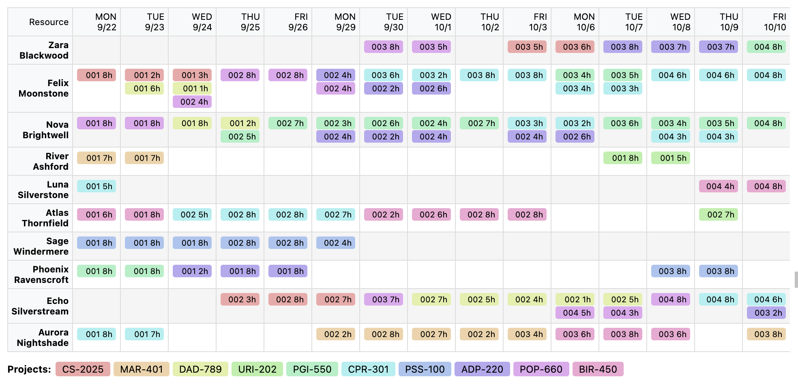

# kpsat

[Generated API docs](https://andrei-filonenko.github.io/kpsat/)
[Simple intro](examples/cp-sat-dsl-example.ipynb)
[A pretty baroque big example for classroom scheduling](examples/classroom-scheduling.ipynb)




A Kotlin DSL for constraint programming built on [CP-SAT](https://developers.google.com/optimization/cp/cp_solver).

Write complex models with **reading-optimized fluent Kotlin** — because the hard part is creating the model, not running it. Optimize for **readability and ease of experimentation**.

## Why Constraint Satisfaction?

Constraint satisfaction is extremely useful and undernormalized. Solvers like the one in this package have been around since the early days of computing, emerging from two highly respected communities:

- **Operations Research** — a field of applied mathematics born during WWII for solving logistics problems
- **Classical AI** — the symbolic reasoning tradition that predates neural networks

It's underhyped, but it's serious business:

- Your nearby **supermarket** uses it to optimize delivery routes
- **Semiconductor manufacturers** use it to design chip production pipelines
- **AWS**, which hosts half the web, uses it to allocate VMs across physical machines
- Even your **package manager** runs a SAT solver to resolve dependencies

Yet every visit to a clinic reveals why it's underutilized: long queue times and an overworked clerk manually arranging appointments on a grid. The technology exists — adoption is the problem.

## Barriers to Entry

I speculate there are several reasons for the adoption gap:

### 1. High Barrier to Entry

Commercial libraries (and conditionally-free ones like Timefold) offer nice, relatively easy-to-use APIs. Open-source alternatives tend to have slower performance and clunkier interfaces.

This is likely due to niche use cases where practitioners know the mathematical model before writing code. In realistic settings, that's rarely feasible — despite the fact that most linear programming models require only 9th-grade math to define.

### 2. Low-Level APIs

For example, [CP-SAT](https://developers.google.com/optimization/cp/cp_solver) — the solver this library is built upon — doesn't provide:

| Feature | CP-SAT | kpsat |
|---------|--------|-------|
| Fluent API | ✗ | ✓ Chainable builder pattern |
| Operator overloading | ✗ | ✓ `a + b`, `x eq y`, `p and q` |
| Soft constraints | ✗ | ✓ With normalization across scales |
| Multiple objectives | ✗ | ✓ Lexicographic ordering |
| Configurable weights | ✗ | ✓ Weights and priorities per constraint |
| Functional aggregations | Manual | ✓ `sum`, `forAll`, `exists`, `allDifferent` |

### 3. Puzzle-Oriented Education

Most introductions to constraint solvers focus on toy problems: Sudoku, N-Queens, magic squares. These are fun but utterly unhelpful for understanding how to apply solvers to real-world design.

The reason is simple: the established communities that create and use solvers **already know** their domain-specific applications:

- **SMT solvers** → traditionally used for code analysis and formal verification
- **MIP solvers** → manufacturing planning and supply chain optimization
- **SAT solvers** → electronic design automation, package managers

But the scope is **much, much wider**. Basically, if you have an NP-hard problem — scheduling, allocation, routing, configuration — you should ask: *can I benefit from a solver?* The answer is usually yes, but nobody teaches you how to get there from a business problem.

### 4. LLM Integration Challenge

Modern chatbots struggle with constraint models because the representation is too abstract. And to be clear: **LLMs cannot solve problems that require a solver** — I've seen attempts to use them for scheduling, but it's not their forte.

## The Vision

**kpsat** aims to solve the ergonomics problem and enable LLM integration.

The core idea: **one model definition can cover a large range of real-world use cases** without losing its structure.

- Build a **library of reusable constraints**
- Allow users (or language models) to **play with constraint weights and priorities**
- Same model structure, different behavior — just adjust the knobs
- No need to rewrite models for each scenario
- **LLM-friendly**: structured domain models that chatbots can reason about and configure

## Philosophy

- **Declarative over imperative** — Express *what* you want, not *how* to compute it
- **Readability first** — The hard part is creating the model; optimize for reading and understanding
- **Ease of experimentation** — Quick iteration on weights, priorities, and constraints
- **Functional composition** — Build complex constraints from simple, composable parts

## Architecture

### Embedded DSL → Traversable AST

The DSL doesn't compile directly to solver calls. Instead, expressions build a **traversable AST** (Abstract Syntax Tree):

```kotlin
val expr = (a + b) * c eq 100L
// Creates: Eq(Prod([Sum([a, b]), c]), Const(100))
```

This AST can be:
1. **Compiled** to solver-specific constraints (CP-SAT, etc.)
2. **Directly evaluated** for unit testing without invoking the solver
3. **Inspected and transformed** programmatically

Direct evaluation is particularly useful for testing constraint logic:

```kotlin
// Test constraint logic without running the solver
val evaluator = DirectEvaluator(mapOf("x" to 5L, "y" to 10L))
val result = evaluator.evaluate(constraint)  // returns true/false or numeric value
```

### Solver Backends

Currently implemented:
- **CP-SAT** (Google OR-Tools)

Planned:
- **Z3** — SMT - very expressive solver from Microsoft which has multiple models
- **Metaheuristic solvers** — For large-scale problems where exact solutions are impractical

The goal is a **unified API** across solvers — same model definition, different backends. Choose the solver that fits your problem characteristics.

### Why CP-SAT?

CP-SAT is the foundation of this library, and for good reason. It combines:

- **One of the fastest SAT solvers** — Consistently top-ranked in international SAT solver competitions
- **Constraint programming techniques** — Propagation and global constraints (all-different, cumulative, etc.)
- **Battle-tested** — Used quietly by multiple enterprises, stable, actively maintained and evolving

The result is **competitive performance with commercial solvers** — despite being completely free and open source (Apache 2.0 license). For many scheduling and combinatorial problems, CP-SAT matches or beats solvers that cost tens of thousands of dollars per year.

Google uses it internally for resource allocation at scale. You get the same solver.

## How to Create Models

A practical workflow for building constraint models:

### 1. Define Hard Constraints First

Hard constraints define the **physical shape** of your problem — the rules that cannot be violated:

- A resource can't be in two places at once
- Tasks have dependencies (A must finish before B starts)
- Capacity limits can't be exceeded
- Deadlines are deadlines

These constraints carve out the space of *feasible* solutions. If no solution satisfies all hard constraints, the problem is infeasible.

### 2. Decide What to Optimize

Pick your objective(s). What makes one feasible solution better than another?

- Minimize total cost
- Maximize utilization
- Minimize makespan (time to complete everything)
- Minimize travel distance

With kpsat, you can have multiple objectives with priorities — the solver optimizes them lexicographically.

### 3. Look at the Solution

Run the solver. The first solution will be *mathematically* optimal but may look **unusual** — solvers optimize for the objective, not for what humans find intuitive.

### 4. Add Soft Constraints

Soft constraints make solutions more **human-like and palatable**:

- Prefer keeping the same resource on an activity (don't split work)
- Prefer consecutive working days over scattered schedules
- Prefer balanced workloads across resources
- Penalize last-minute changes

Soft constraints have weights — you're telling the solver "I'd prefer this, but it's not mandatory."

### 5. Iterate

This is the core loop:
1. Run solver
2. Look at output
3. Ask: "What's wrong with this solution?"
4. Add a constraint to prevent that
5. Repeat

Most of the work is in steps 3-4. The solver is fast; understanding your problem is slow.

### A Note on CP-SAT

This library is built on [CP-SAT](https://developers.google.com/optimization/cp/cp_solver), which is based on a **SAT solver**.

**What's a SAT solver?** It solves the Boolean Satisfiability Problem: given a formula with boolean variables (AND, OR, NOT), find an assignment that makes it true — or prove none exists. SAT was the first problem proven NP-complete (Cook-Levin theorem, 1971), yet modern SAT solvers handle millions of variables through clever algorithms (CDCL, unit propagation, etc.).

CP-SAT extends SAT with:
- Integer variables (but it works best with **bounded integers and intervals**)
- Arithmetic constraints
- Global constraints (all-different, cumulative, etc.)

**Practical tip**: CP-SAT loves boolean variables and interval constraints. If you can model something as "is X assigned to Y?" (boolean) or "X starts at time T" (interval), you're working with the grain of the solver.

## Full Examples

See the [interactive examples notebook](examples/cp-sat-dsl-example.ipynb) for complete working examples:

- **8-Queens Problem** — Classic constraint satisfaction puzzle
- **Resource-Constrained Project Scheduling (RCPSP)** — Real-world scheduling with hard constraints, soft constraints, and multiple objectives

## Quick Example: N-Queens

Place N queens on an N×N chessboard so no two attack each other:

```kotlin
val N = 8

val model = ConstraintSolverBuilder()
    .timeLimit(60)
    .numWorkers(4)
    
    // Variables: queens[i] = row of queen in column i
    .variables { scope ->
        (0 until N).associate { col ->
            "q$col" to scope.int("queen_$col", 0, (N - 1).toLong())
        }
    }
    
    // All rows must be different
    .hard("different_rows") { _, vars ->
        val queens = (0 until N).map { vars["q$it"]!! }
        allDifferent(queens)
    }
    
    // No two queens on same diagonal (↘)
    .hard("different_diag1") { _, vars ->
        val diag1 = (0 until N).map { i -> vars["q$i"]!! + i.toLong() }
        allDifferent(diag1)
    }
    
    // No two queens on same diagonal (↗)
    .hard("different_diag2") { _, vars ->
        val diag2 = (0 until N).map { i -> vars["q$i"]!! - i.toLong() }
        allDifferent(diag2)
    }
    
    .build()

val result = model.solve().getOrElse { throw RuntimeException(it.message) }

if (result.hasSolution) {
    val positions = (0 until N).map { col ->
        result.scope.value(result.variables["q$col"]!!).getOrElse { 0L }.toInt()
    }
    // prints: [0, 4, 7, 5, 2, 6, 1, 3] or similar valid solution
}
```

Output:
```
  a b c d e f g h
8 · · ♛ · · · · · 
7 · · · · · · ♛ · 
6 · ♛ · · · · · · 
5 · · · · · · · ♛ 
4 · · · · ♛ · · · 
3 ♛ · · · · · · · 
2 · · · ♛ · · · · 
1 · · · · · ♛ · · 
```

## DSL Reference

### Operators

| Category | Operators |
|----------|-----------|
| Arithmetic | `+`, `-`, `*`, `/`, `%`, unary `-` |
| Comparison | `eq`, `neq`, `lt`, `leq`, `gt`, `geq` |
| Logical | `and`, `or`, `not`, `implies`, `iff` |
| Conditional | `iif(cond, ifTrue, ifFalse)` |
| Domain | `inDomain(longArray)` |

### Aggregations

```kotlin
sum(items) { it.cost }           // Σ cost
forAll(items) { it.valid }       // ∀ 
exists(items) { it.available }   // ∃ available
allDifferent(listOf(a, b, c))    // a ≠ b ≠ c
count(items) { it.active }       // count where active
min(items) { it.start }          // minimum start
max(items) { it.end }            // maximum end
```

### Model Building

```kotlin
ConstraintSolverBuilder()
    .timeLimit(60)                              // seconds
    .numWorkers(8)                              // parallel threads
    .logProgress(true)                          // enable logging
    
    .variables { scope -> ... }                 // define decision variables
    
    .hard("name") { scope, vars -> ... }        // must be satisfied
    
    .penalize("name",                           // penalty (higher = worse)
        weight = 10,                            // penalty multiplier
        priority = 1,                           // lexicographic level
        minBound = 0L,                          // for normalization
        maxBound = 100L
    ) { scope, vars -> ... }
    
    .reward("name",                             // reward (higher = better)
        weight = 5,
        priority = 1
    ) { scope, vars -> ... }
    
    .minimize("name", priority = 2) { ... }     // objective
    .maximize("name", priority = 1) { ... }     // lower priority = solved later
    
    .build()
    .solve()
```

### Runtime Configuration

Constraint weights and priorities can be modified **any time before `solve()`**. This enables:

- **API-driven configuration** — Expose constraint tuning as REST endpoints
- **LLM function calling** — Let chatbots adjust model behavior through tool use
- **A/B testing** — Same model, different constraint weights

```kotlin
val model = ConstraintSolverBuilder()
    .penalize("resource_splitting", weight = 50, priority = 1) { ... }
    .reward("consecutive_days", weight = 10, priority = 1) { ... }
    .maximize("efficiency", priority = 2) { ... }
    // ... define full model ...

// Later, configure before solving:
model
    .setWeight("resource_splitting", 100)    // increase importance
    .setPriority("consecutive_days", 2)      // solve earlier
    .disable("efficiency")                   // skip this objective
    .build()
    .solve()
```

| Method | Description |
|--------|-------------|
| `setWeight(name, weight)` | Change soft constraint weight |
| `setPriority(name, priority)` | Change soft constraint/objective priority |
| `enable(name)` | Enable a disabled constraint/objective |
| `disable(name)` | Skip a constraint/objective during solving |
| `getHardConstraints()` | Inspect current hard constraint config |
| `getSoftConstraints()` | Inspect current soft constraint config |
| `getObjectives()` | Inspect current objective config |

All constraint types (hard, soft, objectives) can be enabled/disabled at runtime.

## Getting Started

### Build from Source

```bash
cd kotlin/
./gradlew :solver:shadowJar
```

The fat JAR with all dependencies will be at `kotlin/solver/build/libs/solver-all-0.1.0-SNAPSHOT.jar`.

### Play with the Model

Open the [interactive notebook](examples/cp-sat-dsl-example.ipynb) in Kotlin Notebook to experiment with the DSL.

### As a Dependency

```kotlin
dependencies {
    implementation("io.github.andreifilonenko:solver:0.1.0")
}
```

> **Note:** Update the GitHub username in the badge URL above if your repository is hosted under a different account.

## License

MIT

